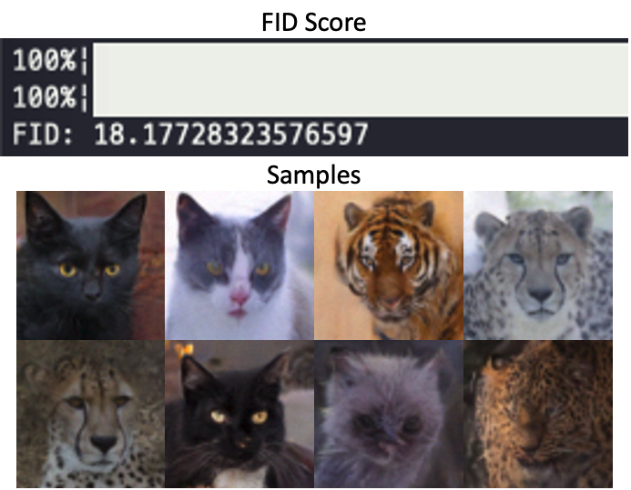

<div align=center>
  <h1>
    Introduction to Diffusion Models
  </h1>
  <p>
    <a href=https://mhsung.github.io/kaist-cs479-fall-2023/ target="_blank"><b>KAIST CS479: Machine Learning for 3D Data (Fall 2023)</b></a><br>
    Programming Assignment 3
  </p>
</div> 

<div align=center>
  <p>
    Instructor: <a href=https://mhsung.github.io target="_blank"><b>Minhyuk Sung</b></a> (mhsung [at] kaist.ac.kr)<br>
    TA: <a href=https://63days.github.io target="_blank"><b>Juil Koo</b></a>  (63days [at] kaist.ac.kr)      
  </p>
</div>

<div align=center>
   
</div>

  
#### Due: October 15, 2023 (Sunday) 23:59 KST
#### Where to Submit: GradeScope

## Setup

We use the same `conda` environment used in Assignment1. You can skip the part of creating conda environment and just install additional packages in `requirements.txt` following the instruction below.

```
conda create -n diffusion python=3.9
conda activate diffusion
conda install pytorch=1.13.0 torchvision pytorch-cuda=11.6 -c pytorch -c nvidia
conda install -c fvcore -c iopath -c conda-forge fvcore iopath
conda install pytorch3d -c pytorch3d
```

Lastly, install the required package within the `requirements.txt`
```
pip install -r requirements.txt
```

## Code Structure
```
.
├── 2d_plot_diffusion_todo    (Task 1)
│   ├── ddpm_tutorial.ipynb       <--- Main code
│   ├── dataset.py                <--- Define dataset (Swiss-roll, moon, gaussians, etc.)
│   ├── network.py                <--- (TODO) Implement a noise prediction network
│   └── ddpm.py                   <--- (TODO) Define a DDPM pipeline
│
└── image_diffusion_todo (Task 2)
    ├── dataset.py                <--- Ready-to-use AFHQ dataset code
    ├── train.py                  <--- DDPM training code
    ├── sampling.py               <--- Image sampling code
    ├── ddpm.py                   <--- (TODO) Define a DDPM pipeline
    ├── module.py                 <--- Basic modules of a noise prediction network
    ├── network.py                <--- Noise prediction network of 2D images
    └── fid
        ├── measure_fid.py        <--- script measuring FID score
        └── afhq_inception.ckpt   <--- pre-trained classifier for FID
```


## Task 0: Introduction
### Assignment Tips

Implementation of diffusion models can be simple once you understand the theory.
So, to learn the most from this assignment, it's highly recommended to check out the details in the
related papers and understand the equations **BEFORE** you start the assignment. You can check out
the resources in this order:

1. [[paper](https://arxiv.org/abs/2006.11239)] Denoising Diffusion Probabilistic Models
2. [[paper](https://arxiv.org/abs/2010.02502)] Denoising Diffusion Implicit Models
3. [[blog](https://lilianweng.github.io/posts/2021-07-11-diffusion-models/)] Lilian Wang's "What are Diffusion Models?"
4. [[slide](./assets/summary_of_DDPM_and_DDIM.pdf)] Summary of DDPM and DDIM

More further reading materials are provided [here](#further-readings).

### Forward Process
Denoising Diffusion Probabilistic Model (DDPM) is one of latent-variable generative models consisting of a Markov chain. In the Markov chain, let us define a _forward process_ that gradually adds noise to the data sampled from a data distribution $\mathbf{x}_0 \sim q(\mathbf{x}_0)$ so that $\mathbf{x}_0$ becomes pure white Gaussian noise at $t=T$. Each transition of the forward process is as follows:

$$ q(\mathbf{x}_t | \mathbf{x}\_{t-1}) := \mathcal{N}(\mathbf{x}_t; \sqrt{1-\beta_t}\mathbf{x}\_{t-1}, \beta_t \mathbf{I}), $$

where a variance schedule $\beta_1, \dots, \beta_T$ controlls the step sizes.

Thanks to a nice property of a Gaussian distribution, one can directly sample $\mathbf{x}_t$ at an arbitrary timestep $t$ from real data $\mathbf{x}_0$ in closed form:

$$q(\mathbf{x}_t | \mathbf{x}_0) = \mathcal{N}(\mathbf{x}_t ; \sqrt{\bar{\alpha}_t} \mathbf{x}_0, (1 - \bar{\alpha}_t) \mathbf{I}). $$

where $\alpha\_t := 1 - \beta\_t$ and $\bar{\alpha}_t := \prod$ $\_{s=1}^T \alpha_s$.

Refer to [our slide](./assets/summary_of_DDPM_and_DDIM.pdf) or [blog](https://lilianweng.github.io/posts/2021-07-11-diffusion-models/) for more details.

### Reverse Process
If we can reverse the forward process, i.e. sample $\mathbf{x}\_{t-1} \sim q(\mathbf{x}\_{t-1} | \mathbf{x}_t)$ iteratively until $t=0$, we will be able to generate $\mathbf{x}_0$ which is close to the unknown data distribution $\mathbf{q}(\mathbf{x}_0)$ from white Gaussian noise $\mathbf{x}_T \sim \mathcal{N}(0, \mathbf{I})$. You can think of this _reverse process_ as denoising process that gradually denoises noise so that it looks like a true sample from $q(\mathbf{x}_0)$ at the end.
The reverse process is also a Markov chain with learned Gaussian transitions:

$$p\_\theta(\mathbf{x}\_{0:T}) := p(\mathbf{x}_T) \prod\_{t=1}^T p\_\theta(\mathbf{x}\_{t-1} | \mathbf{x}_t), $$

where $p(\mathbf{x}_T) = \mathcal{N}(0, \mathbf{I})$ and $p\_\theta(\mathbf{x}\_{t-1} | \mathbf{x}_t) := \mathcal{N}(\mathbf{x}\_{t-1}; \mathbf{\boldsymbol{\mu}}\_\theta (\mathbf{x}_t, t)\boldsymbol{\Sigma}\_\theta (\mathbf{x}_t, t)).$

### Training
To learn this reverse process, we set an objective function that minimizes KL divergence between $p_\theta(\mathbf{x}\_{t-1} | \mathbf{x}_t)$ and $q(\mathbf{x}\_{t-1} | \mathbf{x}_t, \mathbf{x}_0) = \mathcal{N}(\tilde{\boldsymbol{\mu}}_t(\mathbf{x}_t, \mathbf{x}_0), \sigma_t^2 \mathbf{I})$ which is also a Gaussian distribution when conditioned on $\mathbf{x}_0$:

$$\mathcal{L} = \mathbb{E}_q \left[ \sum\_{t > 1} D\_{\text{KL}}( q(\mathbf{x}\_{t-1} | \mathbf{x}_t, \mathbf{x}_0) \Vert p\_\theta ( \mathbf{x}\_{t-1} | \mathbf{x}_t)) \right].$$

As a parameterization of DDPM, the authors set $\boldsymbol{\Sigma}\_\theta(\mathbf{x}_t, t) = \sigma_t^2 \mathbf{I}$ to untrained time dependent constants. As a result, we can rewrite the objective function:

$$\mathcal{L} = \mathbb{E}\_q \left[ \frac{1}{2\sigma\_t^2} \Vert \tilde{\boldsymbol{\mu}}_t(\mathbf{x}_t, \mathbf{x}_0) - \boldsymbol{\mu}\_{\theta}(\mathbf{x}_t, t) \Vert^2 \right] + C $$ 

The authors empirically found that predicting $\epsilon$ noise injected to data by a noise prediction network $\epsilon\_\theta$ is better than learning the mean function $\boldsymbol{\mu}\_\theta$.

In short, the simplified objective function of DDPM is defined as follows:

$$ \mathcal{L}\_{\text{simple}} := \mathbb{E}\_{t,\mathbf{x}_0,\boldsymbol{\epsilon}} [ \Vert \boldsymbol{\epsilon} - \boldsymbol{\epsilon}\_\theta( \mathbf{x}\_t(\mathbf{x}_0, t), t) \Vert^2  ],$$

where $\mathbf{x}_t (\mathbf{x}_0, t) = \sqrt{\bar{\alpha}_t}\mathbf{x}_0 + \sqrt{1 - \bar{\alpha}_t} \boldsymbol{\epsilon}$ and $\boldsymbol{\epsilon} \sim \mathcal{N}(0, \mathbf{I})$.

Refer to [the original paper](https://arxiv.org/abs/2006.11239) for more details.

### Sampling

Once we train the noise prediction network $\boldsymbol{\epsilon}\_\theta$, we can run sampling by gradually denoising white Gaussian noise. The algorithm of the DDPM  sampling is shown below:

<p align="center">
  
</p>

[DDIM](https://arxiv.org/abs/2010.02502) proposed a way to speed up the sampling using the same pre-trained DDPM. The reverse step of DDIM is below:

<p align="center">
  
</p>

Note that $\alpha_t$ notation in DDIM corresponds to $\bar{\alpha}_t$ in DDPM paper.

Please refer to DDIM paper for more details.

## Task 1: Simple DDPM/DDIM pipeline with Swiss-Roll

<p align="center">

</p>

A typical diffusion pipeline is divided into three components:
1. [Forward Process](#forward-process) and [Reverse Process](#reverse-process)
2. [Training](#training)
3. [Sampling](#sampling)

In this task, we will look into each component one by one in a toy experiment and implement them sequentially.
After finishing the implementation, you will be able to train DDPM and evaluate the performance in `ddpm_tutorial.ipynb` under `2d_plot_todo` directory.

❗️❗️❗️ **You are only allowed to edit the part marked by TODO.** ❗️❗️❗️

### TODO
#### 1-1: Build a noise prediction network
You first need to implement a noise prediction network in `network.py`.
The network should consist of `TimeLinear` layers whose feature dimensions are a sequence of [`dim_in`, `dim_hids[0]`, ..., `dim_hids[-1]`, `dim_out`].
Every `TimeLinear` layer except for the last `TimeLinear` layer should be followed by a ReLU activation.

#### 1-2: Construct the forward and reverse process of DDPM
Now you should construct a forward and reverse process of DDPM in `ddpm.py`.
`q_sample()` is a forward function that maps $\mathbf{x}_0$ to $\mathbf{x}_t$.

`p_sample()` is a one-step reverse transition from $\mathbf{x}\_{t}$ to $\mathbf{x}\_{t-1}$ and `p_sample_loop()` is the full reverse process corresponding to DDPM sampling algorithm.

#### 1-3: Construct the reverse process of DDIM
`ddim_p_sample()` and `ddim_p_sample_loop()` are for the reverse process of DDIM. Based on the reverse step of DDIM, implement them.

#### 1-4: Implement the training objective function
In `ddpm.py`, `compute_loss()` function should return the simplified noise matching loss in DDPM paper.

#### 1-5: Training and Evaluation
Once you finish the implementation above, open and run `ddpm_tutorial.ipynb` via jupyter notebook. It will automatically train a diffudion model and measure chamfer distance between 2D particles sampled by the diffusion model and 2D particles sampled from the target distribution.

Take screenshots of a loss curve as well as the chamfer distance results and visualizations of DDPM sampling and DDIM sampling.
<p align="center">
  
</p>

## Task 2: Image Diffusion

<p align="center">
  
</p>

### TODO
If you successfully finish the task 1, copy `2d_plot_todo/ddpm.py` into `image_diffusion_todo/ddpm.py`. They share the same code.

In this task, we will generate $64\times64$ animal images using DDPM with AFHQ dataset. 

Train a model by `python train.py`. 

❗️❗️❗️ DO NOT modify any given hyperparameters. ❗️❗️❗️

It will sample images and save a checkpoint every `args.log_interval`. After training a model, sample & save images by
```
python sampling.py --ckpt_path ${CKPT_PATH} --save_dir ${SAVE_DIR_PATH}
```


We recommend starting the training as soon as possible since the training would take **about half of a day**. 
If you don't have enough time to sample images with DDPM sampling, you can use DDIM sampling which can speed up the sampling time with some sacrifice of the sample quality.

As an evaluation, measure FID score using the pre-trained classifier network we provide:

```
python dataset.py # to constuct eval directory.
python fid/measure_fid.py /path/to/eval/dir /path/to/sample/dir
```


Take a screenshot of a FID score and include at least 8 sampled images.
<p align=center>
  

 
❗️ If you face **negative FID** values, it might be due to an overflow issue with the `linalg.sqrtm` function in the latest version of `scipy`. We've observed that `scipy` version 1.7.3 works correctly. To fix the issue, reinstall scipy to 1.7.3 version by running the command: `pip install scipy=1.7.3`.


## What to Submit

<details>
<summary><b>Submission Item List</b></summary>
</br>

- [ ] Code without model checkpoints
      
**Task 1**
- [ ] Loss curve screenshot
- [ ] Chamfer distance result of DDPM sampling
- [ ] Visualization of DDPM sampling
- [ ] Chamfer distance result of DDIM sampling
- [ ] Visualization of DDIM sampling

**Task 2**
- [ ] FID score result
- [ ] At least 8 generated images
      
</details>

In a single document, write your name and student ID, and include submission items listed above. Refer to more detailed instructions written in each task section about what to submit.
Name the document `{NAME}_{STUDENT_ID}.pdf` and compile a **ZIP** file named `{NAME}_{STUDENT_ID}.zip` containing the following:
- The `{NAME}_{STUDENT_ID}.pdf` document file.
- All `.py` and `.ipynb` script files from the Assignment3 directory. Include both the scripts you have modifed and those that already existed.
- Due to file size, exclude all checkpoint files, even the provided classifier checkpoint file (`afhq_inception_v3.ckpt`).

Submit the zip file on GradeScope.

## Grading
**You will receive a zero score if:**
- **you do not submit,**
- **your code is not executable in the Python environment we provided, or**
- **you modify anycode outside of the section marked with `TODO` or use different hyperparameters that are supposed to be fixed as given.**

**Plagiarism in any form will also result in a zero score and will be reported to the university.**

**Your score will incur a 10% deduction for each missing item in the submission item list.**

Otherwise, you will receive up to 100 points from this assignment that count toward your final grade.

- Task 1
  - 50 points:
    - Achieve CD lower than **20** from DDPM sampling, and
    - achieve CD lower than **40** from DDIM sampling with 50 inference timesteps out of 1000 diffusion timesteps.
  - 25 points: Only one of the two criteria above is successfully met.
  - 0 point: otherwise.
- Task 2
  - 50 points: Achieve FID less than **20**.
  - 25 points: Achieve FID between **20** and **40**.
  - 0 point: otherwise.


## Further Readings

If you are interested in this topic, we encourage you to check out the materials below.

- [Denoising Diffusion Probabilistic Models](https://arxiv.org/abs/2006.11239) 
- [Denoising Diffusion Implicit Models](https://arxiv.org/abs/2010.02502) 
- [Diffusion Models Beat GANs on Image Synthesis](https://arxiv.org/abs/2105.05233) 
- [Score-Based Generative Modeling through Stochastic Differential Equations](https://arxiv.org/abs/2011.13456)
- [What are Diffusion Models?](https://lilianweng.github.io/posts/2021-07-11-diffusion-models/) 
- [Generative Modeling by Estimating Gradients of the Data Distribution](https://yang-song.net/blog/2021/score/)
- [Deep Unsupervised Learning using Nonequilibrium Thermodynamics](https://arxiv.org/abs/1503.03585)
- [Bayesian Learning via Stochastic Gradient Langevin Dynamics](https://www.stats.ox.ac.uk/~teh/research/compstats/WelTeh2011a.pdf)
